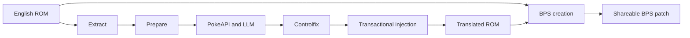

# unbound-translator

[](https://github.com/Simopich/unbound-translator/actions/workflows/release-ready-translations.yml)
[](https://github.com/Simopich/unbound-translator/actions/workflows/test.yml)
[](LICENSE)
[](https://discord.gg/ctFaR77WrR)

A safety-first translation toolchain for Pokemon Unbound ROM text.

`unbound-translator` extracts, localizes, formats, and reinjects game text without expanding the 32 MB ROM. It combines
official PokeAPI localizations with optional LLM translation, preserves game control tokens, applies screen-aware text
layout, and creates redistributable BPS patches instead of ROM files.


> [!IMPORTANT]
> This repository does not provide a Pokemon Unbound ROM. You must supply a legally obtained English source ROM with
> MD5 `9cad8e771940e7f7094d13911552cef0`. Never publish ROM files, save files, API keys, or webhook secrets.

## Contents

- [Status](#status)
- [German Translation](#german-translation)
- [Highlights](#highlights)
- [Use A Released Patch](#use-a-released-patch)
- [Build From Source](#build-from-source)
- [Translation Workflow](#translation-workflow)
- [How Injection Stays Safe](#how-injection-stays-safe)
- [Advanced Workflows](#advanced-workflows)
- [Troubleshooting](#troubleshooting)
- [Ready Translations And Releases](#ready-translations-and-releases)
- [Testing](#testing)
- [Project Structure](#project-structure)
- [Contributing And Support](#contributing-and-support)
- [Roadmap](#roadmap)
- [Acknowledgements](#acknowledgements)
- [License And Legal](#license-and-legal)

## Status

The project is usable but still early and primarily tested with Italian and the German localization documented below.

| Capability | Status |
| --- | --- |
| Release-ready translations | Indonesian (`ready-translations/id.json`), Italian (`ready-translations/it.json`), German (`ready-translations/de.json`) in the [Bladestar2105 fork release](https://github.com/Bladestar2105/unbound-translator/releases/tag/de-v0.1.6) |
| Translation CLI targets | `de`, `en`, `es`, `fr`, `id`, `it`, `pt`, `pt-br` |
| Non-Latin scripts | Not supported yet; likely requires a font patch |
| Supported systems | Windows, macOS, and Linux |
| Python | 3.10 or newer |
| Release format | BPS patch only; `main` publishes stable releases and `qa` publishes prereleases |
| License | [MIT](LICENSE) |
| Source ROM | Pokemon Unbound English, MD5 `9cad8e771940e7f7094d13911552cef0` |

Known limitations include game-specific rendering behavior that may need further testing. Please report reproducible
issues with the affected screen, text, language, and build commit.

## German Translation

The current German localization was contributed by [Bladestar2105](https://github.com/Bladestar2105).

It includes:

- `ready-translations/de.json` with 23,321 extracted entries; 23,315 entries contain German translation data, while six records have no source text.
- A deterministic allocation adjustment in `005_hybrid_injector.py` that prioritizes already-identified reclaimed script owners, plus a regression test for that planning path.
- Pixel-budget QA for 32 setting names, 519 battle messages, 75 settings-menu fields, and 57 mission objectives.
- A lossless wrap-only formatting pass that keeps control tokens intact while fitting German dialogue to the game text window.
- Strict injection validation with `--fail-on-no-space`, reporting zero entries skipped for space, pointer mismatches, implausible pointers, encoding errors, truncation, or bounds failures.
- An independent original-ROM coverage audit that adds five previously unowned Wireless Communication Status slots, including dynamic player counts and the Cancel control.
- Battle command menus keep `Cube`, `Pokémon`, `Flucht`, and related choices as separate menu slots with preserved control layout.
- Automated German QA covers semantic controls, embedded control bytes, printable character support, constrained descriptions, and conservative menu-width budgets; 145 tests pass.
- The final strict German build audited 23,315 translated entries after ROM decoding with zero content mismatches; the injector reported zero no-space, pointer, encoding, bounds, or truncation failures.
- A public BPS patch release that contains no original or patched ROM.
- Upstream review is tracked in [PR #7](https://github.com/Simopich/unbound-translator/pull/7).

Download the [German translation patch v0.1.6](https://github.com/Bladestar2105/unbound-translator/releases/tag/de-v0.1.6) and apply it to a clean Pokémon Unbound v2.1.1.1 source ROM with MD5 `9cad8e771940e7f7094d13911552cef0` and SHA-256 `7aa25bbf568f7cfcf6ee1cf2e9e6ff637350b3d0705c2375cabb6baa7d9739f7`. The patch was round-trip verified against the generated 32 MB output. Release v0.1.6 adds automated width/control-token hardening for German descriptions and menus, preserves the Wireless Communication Status and battle-menu fixes, and contains no ROM file. BPS SHA-256: `5e209e4feac8e4c699f5b8c93c5247ca9d4c61f6d15a8739eea4c4f12cd71aeb`.

## Highlights

- **Lossless extraction:** preserves original PCS text, controls, addresses, categories, and pointer ownership.
- **PokeAPI first:** uses official localized Pokemon, move, item, ability, type, nature, habitat, species, and flavor
  text where a safe match exists.
- **LLM fallback:** supports OpenAI-compatible Chat Completions endpoints or an existing Codex ChatGPT login.
- **Protected controls:** validates placeholders and game tokens before accepting translated batches.
- **Layout-aware output:** wraps dialogue, menus, descriptions, missions, battle messages, and summary text for their
  actual renderers.
- **Transactional injection:** validates every applied relocation and pointer update before writing the output ROM.
- **No silent loss:** unfitted translations remain original and are listed in the map; strict builds can abort instead.
- **Patch-only releases:** GitHub Actions publishes BPS files and never uploads a ROM.

## Use A Released Patch

1. Download `unbound-translated-<language>.bps` from the repository's
   [Releases](https://github.com/Simopich/unbound-translator/releases) page.
2. Verify that your English Pokemon Unbound ROM has MD5 `9cad8e771940e7f7094d13911552cef0`.
3. Apply the BPS file with a BPS-compatible patcher such as
   [Rom Patcher JS](https://www.marcrobledo.com/RomPatcher.js/).
4. Save the patched result as a new ROM. Keep the original ROM unchanged.

For the current German build, use the [German translation patch release](https://github.com/Bladestar2105/unbound-translator/releases/tag/de-v0.1.6).

A BPS patch contains differences only. It is not a playable ROM by itself.

## Build From Source

### Requirements

- Windows 10/11, macOS, or Linux
- Python 3.10 or newer
- Git
- A legally obtained English source ROM matching the required MD5
- For new LLM translations only: an API key/model or a logged-in Codex CLI session
- No compiler or non-Python runtime dependency

The command-line scripts use the Python standard library. `requirements-dev.txt` installs `pytest` for development and
CI. Commands below assume a terminal opened at the repository root.

### Clone The Repository

```bash
git clone https://github.com/Simopich/unbound-translator.git
cd unbound-translator
```

### Set Up macOS Or Linux

```bash
python3 -m venv .venv
source .venv/bin/activate
python -m pip install --upgrade pip
python -m pip install -r requirements-dev.txt
mkdir -p rom out
```

### Set Up Windows PowerShell

```powershell
py -3 -m venv .venv
.\.venv\Scripts\Activate.ps1
python -m pip install --upgrade pip
python -m pip install -r requirements-dev.txt
New-Item -ItemType Directory -Force rom, out | Out-Null
```

If PowerShell blocks activation, run `Set-ExecutionPolicy -Scope Process Bypass` once in that terminal, then retry the
activation command. Alternatively, invoke `.\.venv\Scripts\python.exe` directly instead of activating the environment.

### Add And Verify The Source ROM

Place the source ROM at `rom/unbound.gba`. Verify MD5 with the command for your system:

```bash
# Linux
md5sum rom/unbound.gba

# macOS
md5 rom/unbound.gba
```

```powershell
# Windows PowerShell
(Get-FileHash rom\unbound.gba -Algorithm MD5).Hash.ToLower()
```

Expected result: `9cad8e771940e7f7094d13911552cef0`.

Confirm the environment before running the pipeline:

```bash
python --version
python 005_hybrid_injector.py --help
python -m pytest
```

ROMs, generated ROMs, saves, and `.cache/` are local artifacts and must not be committed.

### Build The Included Italian Translation

The fastest source build uses the already-controlfixed ready translation and does not require an LLM API:

```bash
python 005_hybrid_injector.py rom/unbound.gba ready-translations/it.json -o out/unbound-translated-it.gba --target-lang it --map-output out/hybrid-map-it.json
```

Create a shareable BPS patch:

```bash
python scripts/create_bps.py rom/unbound.gba out/unbound-translated-it.gba -o out/unbound-translated-it.bps
```

Share the BPS file only, never the generated ROM.

## Translation Workflow



### 1. Extract

```bash
python 001_extract_unbound_text.py rom/unbound.gba -o out/unbound-texts.json
```

Extraction is intentionally lossless. The current baseline contains `23,321` unique-address entries, including
`10,828` script strings, `3,508` strict aligned-pointer discoveries, and dedicated categories for menus, battle text,
descriptions, summary screens, missions, and other UI.

### 2. Prepare

```bash
python 002_prepare_translation_text.py out/unbound-texts.json -o out/unbound-texts-prepared.json
```

Preparation keeps `original` untouched, removes source layout from `translation_source`, and replaces semantic/control
tokens with readable protected placeholders for translation.

### 3. Translate

```bash
python 003_llm_translate.py out/unbound-texts-prepared.json --target it --api-base https://opencode.ai/zen/go/v1 --api-key YOUR_API_KEY --model your-model-name --workers 4 --batch-size 20 -o out/unbound-texts-it.json
```

Before LLM calls, the translator queries [PokeAPI v2](https://pokeapi.co/docs/v2) using category-specific IDs, slugs,
English-source matching, and version-aware flavor-text matching. Existing glossary-conforming translations win;
ROM-exclusive records, protected-token entries, unavailable localizations, and unmatched text fall back to the LLM.

Target-language Unbound terminology lives in `glossaries/<language>.json`. When a glossary exists, the translator
loads it automatically, protects every matched place, character, faction, feature, and mission name during LLM calls,
then writes the approved target term into `translated`. On resume, an existing translation missing a required glossary
term is queued for translation again. Use `--glossary PATH` to test another glossary or `--no-glossary` only for
diagnosis. `glossaries/it.json` is the initial Italian proposal and should be reviewed before its wording is treated as
final.

Glossary entries with rigid limits record category-specific `max_length` values and their measurement unit. If full
wording does not fit, `full_target` preserves it while `target` contains the compact reviewable in-game value;
`use_compact_target` marks only limits requiring that value. Other contexts use `full_target`.

PokeAPI responses are cached under `.cache/pokeapi` and looked up in parallel. The cache is ignored by Git and should
not be committed. Resume an interrupted translation by repeating the same command with `--resume`.

### 4. Repair Controls And Layout

```bash
python 004_controlfix_translations.py out/unbound-texts-it.json -o out/unbound-texts-it-controlfix.json --source out/unbound-texts-prepared.json --report out/controlfix-report.json
```

Controlfix restores protected controls and recalculates layout for each renderer. It handles dialogue pages, plain
full-screen scripts, battle templates, menu labels, descriptions, Pokemon summary text, and separate Mission Log versus
pause-menu mission limits. Always run it after translation and before injection.

### 5. Inject

```bash
python 005_hybrid_injector.py rom/unbound.gba out/unbound-texts-it-controlfix.json -o out/unbound-translated-it.gba --target-lang it --map-output out/hybrid-map-it.json
```

The map records capacity, relocations, pointer writes, runtime patches, and loss/error counters. A release-capable build
must report zero missing relocation candidates, pointer mismatches, implausible pointers, encode errors, truncations,
and ability compactions.

Run any script with `--help` for its complete CLI reference.

## How Injection Stays Safe

Pokemon Unbound already occupies a 32 MB ROM, so this project does not expand it or use the old single-text-bank model.
The hybrid injector instead:

1. Writes translations in place when they fit.
2. Relocates oversized pointer-owned strings into vetted writable `0xFF` spans.
3. Can optionally reuse fully owned direct script literals after vetted space is exhausted.
4. Updates every verified pointer source to the new location.
5. Applies target-language runtime patches before generic text writes.

Relocation is transactional: every applied candidate has valid sources and a destination before generic text is
written. Candidates without space, plus oversized fixed slots, remain unchanged and are reported in
`missing_relocations`, `missing_fixed_slots`, and the no-space counters. Pass `--fail-on-no-space` when every
translation must fit or the build must abort. Structured tables, menus, Pokedex data, abilities, battle data, generic
pointer discoveries, hidden/interior pointers, and engine-reserved areas are not reclaimed.

`--reclaim-script-slots` enables the experimental old-slot allocator. It reuses only high-bank script literals whose
owners already have independent `vetted_ff` destinations, whose sources are explicit `msgbox`/`message` operands, and
whose complete slots have no hidden exact or interior ROM pointers. Reclaimed destinations accept only `scripts` and
`plain_scripts`; heuristic `pointer_texts` remain in vetted FF space. Allocation reserves vetted FF for entries that
cannot use reclaimed slots, preventing eligible scripts from starving restricted text. Release builds enable this mode
with `--fail-on-no-space`, so any incomplete translation aborts instead of producing a partial patch. Keep validating
generated ROMs on crash-sensitive Pokédex, Summary, PC, Mission Log, battle, and save/reload paths.

Fragile engine text is marked `no_relocation` and must remain in place. Fixed-size entries can provide a complete,
token-safe `translated_fixed` display value while retaining full wording in `translated`. The diagnostic
`--allow-lossy-fit` option must never be used for a release build.

Language-specific runtime behavior lives in one file per patch under `patches/<language>/`. The injector validates and
reports every applied patch. Italian currently includes Pokedex category-order and Mission Log tab-title patches.

## Advanced Workflows

### Use A Codex ChatGPT Login

Log in once with `codex login`, then translate without an API key:

```bash
python 003_llm_translate.py out/unbound-texts-prepared.json --target it --auth chatgpt --workers 1 --batch-size 10 -o out/unbound-texts-it.json
```

`CODEX_ACCESS_TOKEN` and `--codex-profile` are also supported. A `--model` override is optional in this mode.

### Audit Missing Text

```bash
python 001_extract_unbound_text.py rom/unbound.gba -o out/unbound-texts.json --audit-menu-text --audit-string "Missing text" --audit-output out/text-audit.json
```

`found_but_not_extracted` requires a proven table, record, pointer source, script operand, or bounded text bank before
adding extraction. `not_found_as_pcs_text` may indicate graphical, compressed, custom-encoded, or dynamically assembled
text. `--include-orphans` and `--all-pointers` are noisy discovery tools, not safe default extraction modes.

### Build A Focused Debug ROM

Use translation filters such as `--include-ids`, `--include-id-ranges`, `--include-categories`, or
`--include-category-prefixes` to create a small test JSON. Entries outside the filter are omitted.

```bash
python 003_llm_translate.py out/unbound-texts-prepared.json --target it --api-base https://opencode.ai/zen/go/v1 --api-key YOUR_API_KEY --model your-model-name --include-category-prefixes menu_ --priority-order --limit 1000 -o out/debug-unbound-texts-it.json --overwrite
```

Then run controlfix and injection against that debug JSON. Use a full translation build when the bug depends on global
ROM text or relocation capacity.

### Edit A Controlfixed Translation

Do not manually remove line controls one by one. Create an editable copy first:

```bash
python 006_decontrolfix_translations.py out/unbound-texts-it-controlfix.json -o out/unbound-texts-it-editable.json
```

Edit `translated`, rerun controlfix, and inject again. Decontrolfix preserves the prior wrapped value in
`translated_controlfixed` by default but cannot reverse every earlier trim or repair.

### Check Capacity Without Writing A ROM

```bash
python 005_hybrid_injector.py rom/unbound.gba ready-translations/it.json -o out/unbound-translated-it.gba --target-lang it --map-output out/hybrid-map-it.json --dry-run --reclaim-script-slots --fail-on-no-space
```

Inspect `missing_relocations`, `missing_fixed_slots`, and the no-space category counts. Shorten translations category
by category using natural phrasing before recognizable abbreviations. Add `--fail-on-no-space` to make this audit fail
until every entry fits. Never solve capacity by enabling lossy fitting.

## Troubleshooting

### Source ROM Fails Validation

The injector and release workflow expect MD5 `9cad8e771940e7f7094d13911552cef0`. A different Unbound revision or an
already-patched ROM is not a safe input. Keep the original ROM unchanged and patch a new copy.

### Translation Appears Stuck Before LLM Calls

PokeAPI localization runs first and displays its own progress. Cached responses live in `.cache/pokeapi`. Tune network
work with `--pokeapi-workers`, `--pokeapi-timeout`, or `--pokeapi-cache`; use `--no-pokeapi` only to diagnose the
localization pass.

### API Returns HTTP 403 Or Error 1010

The upstream gateway rejected the request before the model handled it. Verify the provider URL and credentials, then
try the script's browser-like default User-Agent or set `--user-agent`. For OpenCode, use
`--api-base https://opencode.ai/zen/go/v1`; the translator appends `/chat/completions`.

### Control Or Placeholder Mismatch

Do not edit protected placeholders away. Rerun the affected translation with a smaller batch or targeted ID, then run
controlfix with the prepared source JSON and inspect `controlfix-report.json`.

### Relocation Preflight Does Not Fit

Do not use `--allow-lossy-fit`. Run with `--dry-run --fail-on-no-space`, then shorten natural wording category by
category while preserving meaning and protected tokens. Without strict mode, inspect skipped no-space counters and map
records; those entries remain original. A pointer mismatch or unsafe ownership problem belongs in injection or
extraction logic, not translation shortening.

### The ROM Builds But A Screen Freezes Or Corrupts

Keep the failing ROM, map, save, entry IDs, and exact reproduction steps local. Compare the map's relocation and runtime
patch records, reproduce with the smallest valid build, and report the affected Pokemon, menu, battle, or event. Never
attach a ROM or save file to a public issue.

## Ready Translations And Releases

`ready-translations/` contains one complete, controlfixed JSON per release language. Files are named by language code;
the release workflow turns each one into `unbound-translated-<language>.bps`.

`.github/workflows/release-ready-translations.yml` runs on every push to `main` or `qa` and can also be started
manually. It:

1. Downloads the private source ROM from `UNBOUND_ENGLISH_ROM_URL`.
2. Verifies the required MD5.
3. Injects every ready translation directly with safe script-slot reclamation and strict no-space failure; controlfix is
   not rerun in CI.
4. Creates BPS-only assets and removes temporary translated ROMs.
5. Publishes a stable release for `main` or a prerelease for `qa`, with flag-marked assets and linked commit messages.
6. Optionally announces successful releases through `DISCORD_WEBHOOK_URL`.

Failed or cancelled builds do not notify Discord, and notification delivery failure does not fail an otherwise
successful release. The current Italian ready translation was produced with DeepSeek V4 Flash and subsequently curated
and controlfixed in this repository.

## Testing

Install the development dependency and run the complete fixture-based suite:

```bash
python -m pip install -r requirements-dev.txt
python -m pytest
```

Most tests do not require a ROM. Layout/control bugs should include a focused JSON fixture and regression test. Changes
to translation, layout, injection, or runtime patches should also produce an applicable test ROM and injector map when
the required local inputs are available.

## Project Structure

| Path | Purpose |
| --- | --- |
| `001_extract_unbound_text.py` | Lossless extraction and PCS coverage audits |
| `002_prepare_translation_text.py` | Translation-source cleanup and protected placeholders |
| `003_llm_translate.py` | PokeAPI localization and LLM fallback |
| `004_controlfix_translations.py` | Control repair and renderer-specific layout |
| `005_hybrid_injector.py` | Transactional in-place writes, relocation, and runtime patches |
| `006_decontrolfix_translations.py` | Editable cleanup of controlfixed JSON |
| `lib/` | PCS codec, font metrics, token helpers, PokeAPI client, and vetted free space |
| `patches/<language>/` | One target-language runtime behavior per patch file |
| `ready-translations/` | Canonical controlfixed release inputs |
| `scripts/create_bps.py` | BPS patch creation |
| `tests/` | Fixture-based regression suite |
| `.agents/skills/` | Repository-specific Codex workflows |

## Contributing And Support

Issues and pull requests are welcome. Before submitting a change:

- Keep extraction lossless and shared scripts language-agnostic.
- Use PokeAPI localization, then Bulbapedia/Pokemon Database, then the official target-language FireRed ROM for manual
  wording and layout references.
- Add focused tests for extraction, token, layout, injection, or runtime-patch changes.
- Run `python -m pytest` and report any game-level testing performed.
- Never commit ROMs, generated ROMs, save files, `.cache/`, API credentials, or webhook URLs.

Use [GitHub Issues](https://github.com/Simopich/unbound-translator/issues) for reproducible bugs and feature requests.
Use [Discord](https://discord.gg/ctFaR77WrR) for community discussion.

## Roadmap

- Add and validate ready translations for more Latin-script languages.
- Continue extraction coverage and translation/layout polish.
- Add deterministic emulator-level E2E testing with a pinned headless mGBA/libmgba runner. Planned scenarios include
  Pokemon Summary navigation, caught-Pokemon Pokedex pages, PC boxes, Mission Log, single/double trainer battles, and
  save/reload flows using replayable inputs and normal save fixtures. Freeze detection should combine state/memory
  checkpoints, input response, framebuffer changes, and timeouts. Failures should retain screenshots, emulator logs,
  frame number, CPU state, and a small memory dump without ever uploading a ROM.

## Acknowledgements

- [Bladestar2105](https://github.com/Bladestar2105) contributed the German localization and published its BPS patch release.
- [Hendi Saputra](https://github.com/orangesoncom) contributed the initial Indonesian translation through
  [PR #1](https://github.com/Simopich/unbound-translator/pull/1).
- [PokeAPI](https://pokeapi.co/) provides official localized Pokemon data used before LLM fallback.
- [Olcmyk/Meowth-GBA-Translator](https://github.com/Olcmyk/Meowth-GBA-Translator) inspired the project's earliest
  experiments. Unbound's already-full 32 MB ROM required an independent extractor and hybrid injector.
- [AntonyKervazoCanut/gba_translator](https://github.com/AntonyKervazoCanut/gba_translator) and the local
  `out/working_fr.gba` build may be consulted as optional behavioral second opinions for difficult bugs. This project
  keeps its own architecture and does not copy that translator wholesale.
- The official target-language FireRed ROM is used only as a local wording/layout reference when legally available;
  Italian development uses `out/red_ita.gba`.

## License And Legal

The project software and translation data are available under the permissive [MIT License](LICENSE). You may use,
modify, distribute, sublicense, and sell copies as long as the copyright and license notices are preserved.

Pokemon, Pokemon Unbound, FireRed, Nintendo, Game Freak, and related names and assets belong to their respective owners.
This unofficial project is not affiliated with or endorsed by them. The repository distributes tooling, translation
data, and BPS patches only. The MIT License does not grant rights to third-party games, ROMs, trademarks, or copyrighted
assets. Obtain and use ROMs in accordance with the laws that apply to you.
